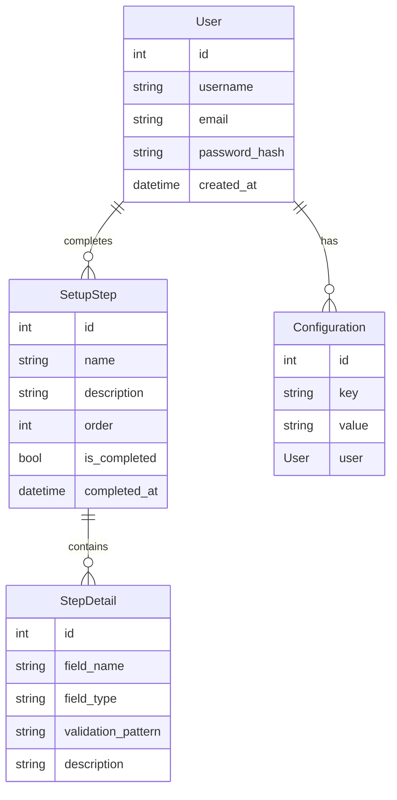

# Moltbot Technical Specification

## 1. Overview

Moltbot is a lightweight, opinionated onboarding and setup system designed to streamline the initial experience for new users. The system provides a guided workflow that captures essential user information and configures the environment according to predefined best practices.

## 2. Architecture Overview

Moltbot follows a client-server architecture with a stateless web service backend and a frontend UI component.

### 2.1 System Components

1. **Frontend**:
   - Web-based user interface built with React 18
   - State management using Redux Toolkit
   - Form validation with Zod schemas

2. **Backend**:
   - RESTful API service built with FastAPI
   - Database integration with PostgreSQL
   - Authentication via JWT tokens
   - Background processing with Celery

3. **Database**:
   - PostgreSQL 15 as primary data store
   - Schema includes user profiles, setup steps, and configuration settings

4. **Deployment**:
   - Docker containers for all components
   - Kubernetes orchestration for scaling
   - CI/CD pipeline with GitHub Actions

## 3. Data Model

### 3.1 Core Entities



### 3.2 Database Schema

```sql
-- User table
CREATE TABLE users (
    id SERIAL PRIMARY KEY,
    username VARCHAR(50) UNIQUE NOT NULL,
    email VARCHAR(100) UNIQUE NOT NULL,
    password_hash VARCHAR(255) NOT NULL,
    created_at TIMESTAMP WITH TIME ZONE DEFAULT NOW()
);

-- Setup steps table
CREATE TABLE setup_steps (
    id SERIAL PRIMARY KEY,
    name VARCHAR(100) NOT NULL,
    description TEXT,
    order_number INT NOT NULL,
    is_completed BOOLEAN DEFAULT FALSE,
    completed_at TIMESTAMP WITH TIME ZONE
);

-- Step details table
CREATE TABLE step_details (
    id SERIAL PRIMARY KEY,
    step_id INT REFERENCES setup_steps(id),
    field_name VARCHAR(50) NOT NULL,
    field_type VARCHAR(20) NOT NULL,
    validation_pattern VARCHAR(255),
    description TEXT,
    is_required BOOLEAN DEFAULT TRUE
);

-- User configurations table
CREATE TABLE user_configurations (
    id SERIAL PRIMARY KEY,
    user_id INT REFERENCES users(id),
    key VARCHAR(100) NOT NULL,
    value TEXT NOT NULL,
    created_at TIMESTAMP WITH TIME ZONE DEFAULT NOW()
);
```

## 4. Key APIs/Interfaces

### 4.1 RESTful API Endpoints

```http
GET /api/setup-steps
GET /api/setup-steps/{step_id}
POST /api/setup-steps/{step_id}/complete
GET /api/user-configurations
POST /api/user-configurations
```

### 4.2 API Response Structure

```json
{
  "status": "success",
  "data": {
    "setup_steps": [
      {
        "id": 1,
        "name": "Welcome",
        "description": "Welcome to Moltbot",
        "order": 1,
        "is_completed": false,
        "steps": [
          {
            "id": 1,
            "field_name": "username",
            "field_type": "text",
            "validation_pattern": "^[a-zA-Z0-9_]{3,20}$",
            "description": "Your username",
            "is_required": true
          }
        ]
      }
    ]
  }
}
```

## 5. Technology Stack

### 5.1 Frontend

- **Framework**: React 18
- **State Management**: Redux Toolkit
- **Form Handling**: Formik
- **Validation**: Zod
- **UI Components**: Material-UI
- **Build Tools**: Vite
- **Testing**: Jest + React Testing Library

### 5.2 Backend

- **Framework**: FastAPI
- **Database**: PostgreSQL
- **Authentication**: JWT
- **Background Tasks**: Celery
- **Dependency Injection**: Pydantic
- **Testing**: pytest

### 5.3 Deployment

- **Containerization**: Docker
- **Orchestration**: Kubernetes
- **CI/CD**: GitHub Actions
- **Monitoring**: Prometheus + Grafana

## 6. Dependencies

### 6.1 Python Dependencies

```python
# requirements.txt
fastapi==0.104.1
uvicorn==0.24.0
sqlalchemy==2.0.25
psycopg2-binary==2.9.9
pydantic==2.5.2
celery==5.3.6
redis==4.5.7
python-jose==3.3.2
passlib==1.7.4
```

### 6.2 Frontend Dependencies

```json
// package.json
{
  "dependencies": {
    "react": "^18.0.0",
    "react-dom": "^18.0.0",
    "react-redux": "^8.1.0",
    "redux": "^8.1.0",
    "redux-thunk": "^
